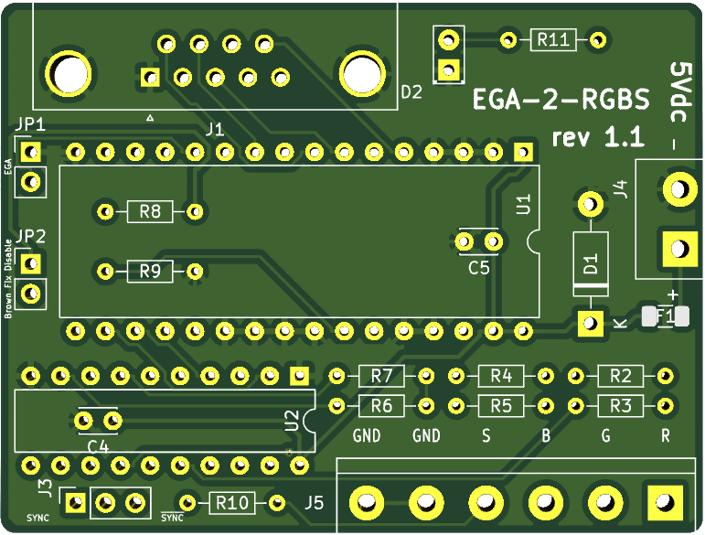

# EGA-2-RGBS

Months ago I ran into [this](https://www.youtube.com/watch?v=vwKA1z8tg1g&t=527) video on YouTube that described how to implement an EGA/CGA to analog RGBS signal using just a ROM and a few passive components.
Thinking it was a nice idea, I decided to implement my variant of it (including the tool that generates the values to program the EPROM), also including an optional buffer on the outputs of the ROM.

**CAVEAT EMPTOR:** For now I tested this board only in DOS with a CGA card. Will update this note when I test EGA and colours.

Note that this **will not convert EGA/CGA to VGA**, it will just make the signal analog and compatible with either a SCART input or a scaler like the GBS8200 (tested with [gbs-control](https://github.com/ramapcsx2/gbs-control) firmware).

## Jumpers

- JP1: Bridge if you are using this with an EGA card, remove bridge for CGA
- JP2: Disable Brown colour fix for CGA. No effect on EGA
- JP3: Bridge 1-2 to output a CSYNC signal, bridge 2-3 for /CSYNC

## Building the board

### BOM

- 1x 20pin socket (on U2)
- 1x 32pin wide socket (on U1)
- 2x 100nF ceramic caps (C5 and C4)
- 1x Right angle DB9 female PCB connector (J1)
- 1x 6 or 5 pin screw terminal (J5)
- 1x 2 pin screw terminal (J4)
- 1x 1206 SMD fuse rated around ~100mA (F1), **100mA is already very high for the power consumption of the board, but I had these at hand** 
- 1x 3 pin 2.54mm male pcb header, plus jumper (J3)
- 2x 2 pin 2.54mm male pcb header, plus jumpers (JP1 and JP2)
- 1x First random led you have at hand, optional (D2)
- 1x 1N4733A 5.1v zener diode (D1)
- 1x 74HC244 DIP, optional (U2)
- 1x 27C010 DIP (U1)
- 4x 470 1/4w resistors (R2, R4, R6, R10)
- 3x 1.5k 1/4w resistors (R3, R5, R7)
- 1x 1k 1/4w resistor (R11)
- 2x 4.7k 1/4w resistors (R8, R9)

Remember to program the EPROM with the bin file provided in the repository.

### Building on the cheap

You can omit the following components:

#### Power

Omit F1 and D1, bridge the two connections points of F1. Do this if you trust your power supply and yourself not to make shorts.

You can also omit the power indicator led D2 and its resistor R11

#### Sockets

You can omit both U1 and U2 sockets. Remember to mount C4, C5, R8 and R9 on the underside of the board if you do this.

#### Output buffer

You can omit U2 entirely. Just bridge the following points on the footprint:

- 2->18
- 4->16
- 6->14
- 8->12
- 11->9
- 13->7
- 15->5
- 17->3

Also omit C4 in this case.

## Credits

- [TheRasteri](https://www.youtube.com/channel/UCO1ifHwXHkEyCLFk2b7Z8xA) on YouTube for the original idea